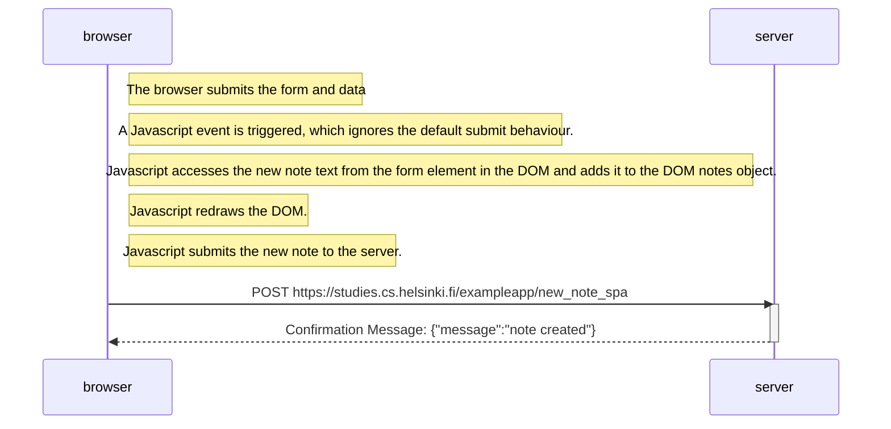

```mermaid
sequenceDiagram
    participant browser
    participant server

    Note right of browser: The browser submits the form and data
    Note right of browser: A Javascript event is triggered, which ignores the default submit behaviour.
    Note right of browser: Javascript accesses the new note text from the form element in the DOM and adds it to the DOM notes object.
    Note right of browser: Javascript redraws the DOM. 
    Note right of browser: Javascript submits the new note to the server. 

    browser->>server: POST https://studies.cs.helsinki.fi/exampleapp/new_note_spa
    activate server
    server-->>browser: Confirmation Message: {"message":"note created"}
    deactivate server


```
